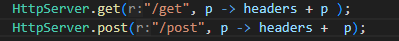
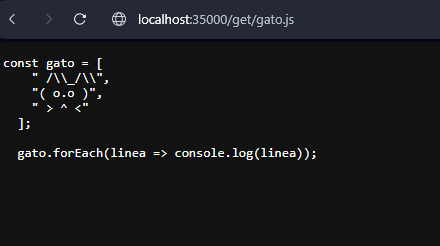
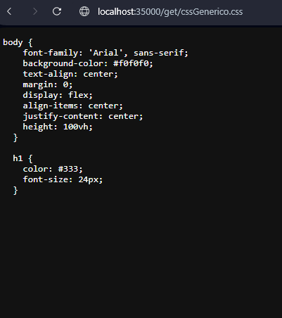
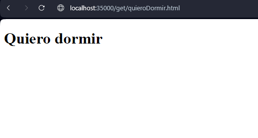
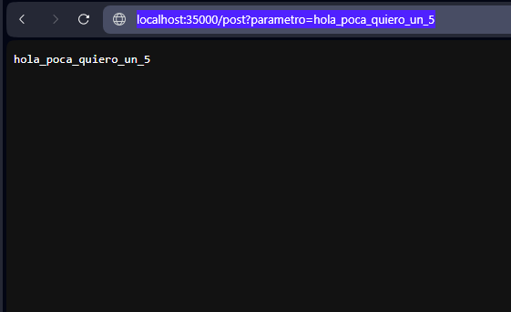
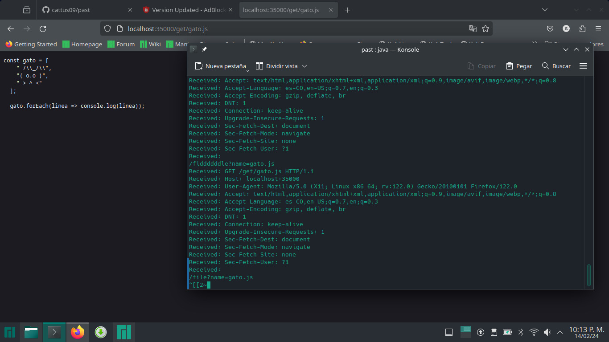

# TALLER 3: MICROFRAMEWORKS WEB

Servidor web para soportar una funcionalidad similar a la de Spark. Su aplicación permite el registro de servicios get y post usando funciones lambda. 


### Requisitos 

* [Git](https://git-scm.com/) - Control de versiones
* [Maven](https://maven.apache.org/) - Manejador de dependencias
* [Java](https://www.oracle.com/java/technologies/downloads/#java21) - Lenguaje de programación


### Instalación 

Clonamos el proyecto con el comando:

```bash
git clone https://github.com/cattus09/taller_2_AREP.git

```

## Ejecutando la aplicación

Para ejecutar la aplicación, usamos el siguiente comando en la terminal:

```bash
mvn exec:java '-Dexec.mainClass=edu.escuelaing.arep.app.lambda.SagvSpark'

```

En el buscador de su preferencia ingresamos a: 

[http://localhost:35000/](http://localhost:35000/).

En esta página, tenemos la posibilidad de buscar películas y obtener detallada información sobre ellas.

## Ejecutando las pruebas 

Usamos el siguiente comando para ejecutar las pruebas:

```bash
mvn test
```

## Generando Javadoc 

Para generar la documentación de la aplicación, use el siguiente comando: 

```bash
mvn site
```

los archivos Javadoc se generarán en el directorio `target/site/apidocs` dentro del proyecto.

entre a la la carpeta `target/site/` y ejecute el `index.html` en la pagina encontrar la documentacion del trabajo 

## Descripción de la aplicación 

Esta aplicación utiliza funciones Lambda para gestionar las operaciones GET y POST. Al emplear la función /get/ en el buscador, se mostrará en la aplicación el resultado de la búsqueda correspondiente. Por otro lado, al utilizar la función /post/, se visualizará la información que se está enviando a la aplicación

Los módulos de la aplicación incluyen:

* **HttpServer**:  Contiene la implementación del servidor web de la aplicación.
* **SagvSpark**:   Contiene las funciones lambda y la clase main
* **SagvService**: Es la interfas
## Pruebas 
### get y post


### get
* **js**:



* **css**:



* **html**:



### post


* **linux**:


las demas pruebas tambien sireben no se colocaron para eliminar redundancia

## Autores 

* **Sergio gonzalez** - [cattus09](https://github.com/cattus09)


"# taller_2_AREP" 
